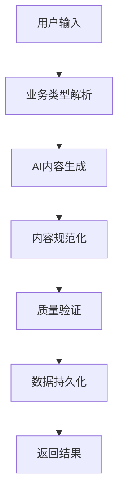

# SEO内容生成器

一个基于AI的SEO内容生成工具，可以根据业务类型自动生成优化的标题、描述和关键词。

## 功能特点

- 基于AI的SEO内容生成
- 智能关键词提取和优化
- 内容质量验证
- 支持内容管理（CRUD操作）
- 内容搜索功能
- 数据分析和统计

## 技术栈

- 后端：Python + Flask
- 数据库：TinyDB（JSON文件数据库）
- AI模型：Llama-3.2-3B-Instruct

## 安装和运行

1. 克隆项目：
```bash
git clone [项目地址]
cd SEO-Generate
```

2. 安装依赖：
```bash
pip install -r requirements.txt
```

3. 运行服务器：
```bash
python run.py
```

## API接口

### 生成SEO内容
```
POST /api/generate
请求体：
{
    "business_type": "智能照明"  # 必填，业务类型
}
```

### 获取内容列表
```
GET /api/contents?limit=10&skip=0
```

### 搜索内容
```
GET /api/search?q=关键词
```

### 获取单个内容
```
GET /api/contents/<content_id>
```

### 更新内容
```
PUT /api/contents/<content_id>
请求体：
{
    "title": "新标题",
    "meta_description": "新描述",
    "keywords": ["关键词1", "关键词2"]
}
```

### 删除内容
```
DELETE /api/contents/<content_id>
```

### 数据分析
```
GET /api/analytics/overview
GET /api/analytics/keywords
```

## 配置说明

配置文件位于 `config` 目录下：
- `config.py`：主配置文件
- `prompts.py`：AI提示词配置

## 项目结构

```
SEO-Generate/
├── backend/
│   ├── api/             # API路由
│   ├── models/          # 数据模型
│   ├── services/        # 业务逻辑
│   ├── utils/          # 工具函数
│   └── config/         # 配置文件
├── data/               # 数据存储
└── tests/             # 测试文件
```

## 开发说明

1. API返回格式统一为：
```json
{
    "success": true/false,
    "data": {},
    "error": "错误信息"
}
```

2. 错误处理：所有API都有统一的错误处理机制，确保返回友好的错误信息。

3. 数据验证：使用内容验证器确保生成的内容符合SEO标准。

## AI生成SEO内容的工作流程

### 1. 系统架构
```
用户请求 -> API接口 -> SEO生成器 -> AI模型 -> 内容验证 -> 数据存储
```

### 2. AI生成过程

#### 2.1 思维链提示
系统采用思维链（Chain of Thought）方法来引导AI生成高质量的SEO内容：

1. **系统提示**：
   - 设定AI角色为SEO专家
   - 提供SEO内容生成的规范和标准
   - 说明输出格式要求

2. **示例学习**：
   - 提供优质SEO内容示例
   - 展示关键词密度和布局
   - 演示元描述的最佳实践

3. **分步思考**：
   ```
   Step 1: 分析业务类型，提取核心概念
   Step 2: 构思标题，确保包含主要关键词
   Step 3: 编写元描述，突出价值主张
   Step 4: 选择相关关键词，确保语义相关性
   ```

#### 2.2 质量控制

1. **内容验证**：
   - 标题长度：10-60字符
   - 元描述长度：50-160字符
   - 关键词数量：3-5个
   - 关键词相关性检查

2. **优化规则**：
   - 确保关键词自然分布
   - 避免关键词堆砌
   - 保持语义连贯性
   - 符合搜索意图

### 3. 数据流转过程



1. **输入处理**：
   - 验证业务类型有效性
   - 预处理用户输入

2. **内容生成**：
   - 调用AI模型
   - 处理模型响应
   - 提取JSON数据

3. **数据处理**：
   - 格式标准化
   - 字段验证
   - 数据存储

### 4. 示例输出

```json
{
    "title": "智能家居控制系统 - 打造智能生活新体验",
    "metaDescription": "专业的智能家居控制方案，支持灯光、空调、安防等多设备联动。简单易用的操作界面，让智能生活触手可及。",
    "keywords": [
        "智能家居",
        "设备控制",
        "家居自动化",
        "智能生活",
        "设备联动"
    ]
}
```

### 5. 性能优化

1. **模型优化**：
   - 使用float16减少内存占用
   - 启用CUDA加速
   - 模型量化处理

2. **缓存策略**：
   - 相似业务类型结果缓存
   - 热门关键词缓存
   - 生成结果临时缓存

3. **并发处理**：
   - 异步任务处理
   - 请求队列管理
   - 结果异步返回

### 6. 错误处理

1. **输入验证**：
   - 业务类型有效性检查
   - 参数完整性验证
   - 字符编码处理

2. **生成失败处理**：
   - 重试机制
   - 降级策略
   - 友好错误提示

3. **异常监控**：
   - 错误日志记录
   - 性能指标监控
   - 质量指标跟踪

## 许可证

MIT License
